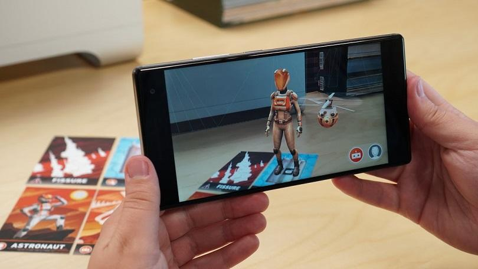
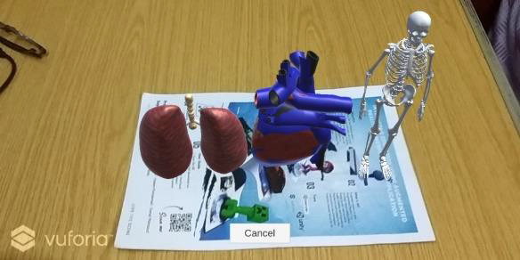
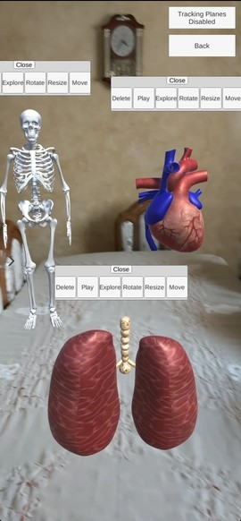
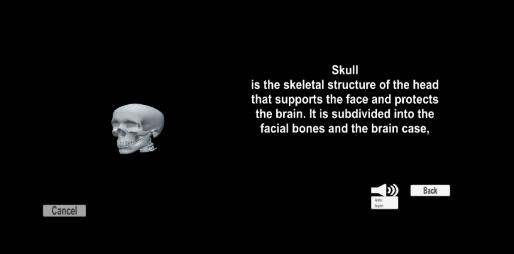
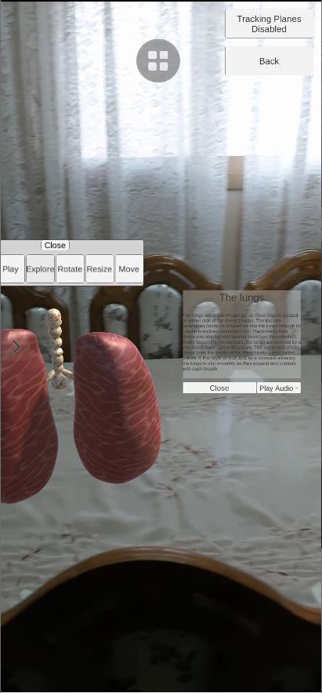
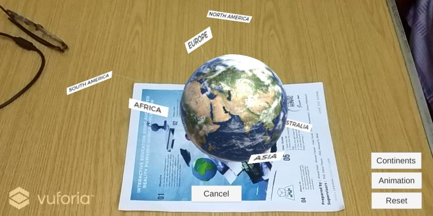
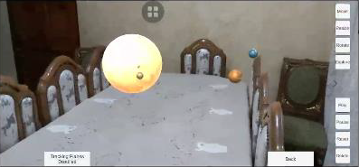

# Graduation project
## Interactive Education using Augmented Realty Powered Mobile Application

<br>

* In alignment with Egypt's vision 2030 and its great intentions for digital transformation the ministry of education has provided students with
educational tablet devices that digitalize their learning journey.

* The ministry is also working on digitizing the entire education system, while providing a more engaging learning experience that depends on interactive learning, rather than memorization.

* We noticed that Augmented Reality (AR) has recently developed rapidly and is widely used in education to help students better understand their subjects and complex concepts due to its strong sense of immersion and interaction, so we developed a mobile application powered by AR that aims to help students in their learning journey.

* Our app tries to make learning easier and more fun, and all this using augmented reality technology. Through the application, the student can ```interact with the curricula, hear information and see three-dimensional objects without relying on his imagination only```. We achieved this through AR technology, object manipulation, animation, information panels and audio.

<br>

## The application harnesses the power of 2 types of augmented reality: 

<br>

Type |Describtion|Image
|-----------------|-------------|-------------|
Marker-Based AR  |It makes use of device's camera and a virtual marker as a target to activate some AR components just when the target is identified by the camera.|
Marker-Less AR   |The device's sensors collect visual data from the physical world in terms of feature points. Clusters of feature points that appear to lie on common horizontal or vertical surfaces, are likely to be tables or walls, thus surfaces and planes are detected and 3D objects can be augmented on it.|

> Check this part of our recorded presentation for more details about [types of AR and mobile interaction](https://www.youtube.com/embed/7Odu_44JaV4?start=591) .

<br>

--- 

## Tools used
* To create animations, modify the graphic content and 3d models we used [Blender](https://www.blender.org/)
* To achieve marker based AR expierence we used [Vuforia SDK](https://developer.vuforia.com/) 
* To achieve marker-less AR expierence we used [AR Foundation SDK](https://docs.unity3d.com/Packages/com.unity.xr.arfoundation@4.2/manual/index.html) 
* To Create android mobile application we used [Android Studio SDK](https://docs.unity3d.com/540/Documentation/Manual/android-sdksetup.html)

* All SDks are connected to [Unity Game Engine](https://docs.unity3d.com/Manual/index.html). The core of our project that allows *C#* scripting. We created scripts to select graphic objects , control its movement, navigate scenes, creating user interface and its functions.

> Check [Chapter 4](https://github.com/Ahmadkater/GP2020/blob/master/FinalGPbook2020.pdf) in our book for more details about SDKs, Unity engine and scripts.

<br>

---

## The application offers 2 subjects to learn

<br>

* Including ```Astronomy``` and ```Anatomy of The Human Body``` with many 3D models and animations that the student can ```explore, manipulate, interact with and learn about  by reading the provided info-graphs and listen``` to it in ```English ``` or in ```Arabic``` .

* In ```Astronomy``` subject there are models of the solar system and planets.
In ```Human Body``` there are models of Heart , Lung , Skeletal System , Eye. All supported with info-graphs and audio.

* Sample images

|Marker-Based Image Target AR part | Marker-Less AR part|
|-----------------------------|---------------|
| ||
| ||
|||

<br>

> For more information check [Book](https://github.com/Ahmadkater/GP2020/blob/master/FinalGPbook2020.pdf) and [Paper](https://github.com/Ahmadkater/GP2020/blob/master/Interactive%20Education%20using%20Augmented%20Realty%20Powered%20Mobile%20Application%20paper.pdf)

---

## Demo

> Check [Full Demo](https://youtu.be/7Odu_44JaV4?t=1603)

<details>
  <summary>See sample videos</summary>
  
  https://user-images.githubusercontent.com/36134615/145988262-7fcb1907-cb51-46ea-a758-e8f239e5de49.mp4

</details>


